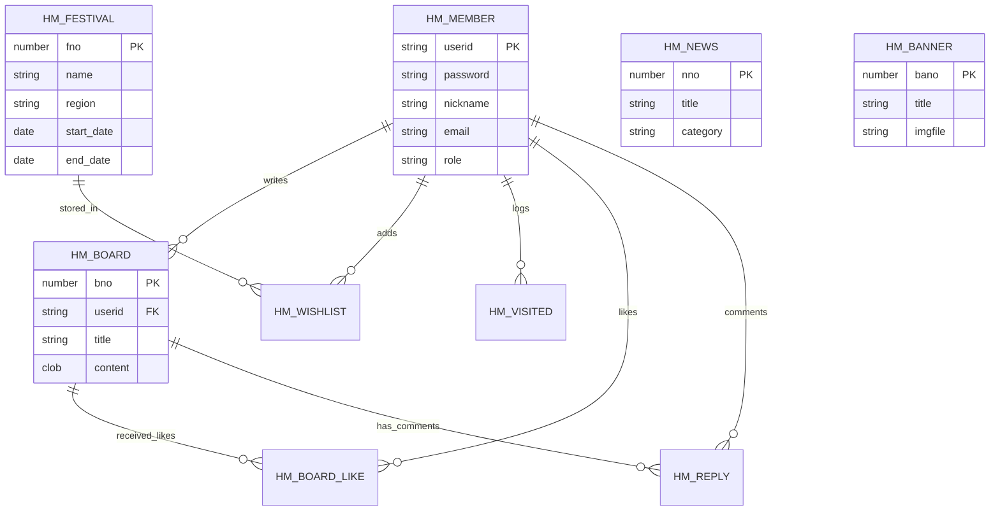

# 韓まつ (HANMATSU) - 韓国フェスティバル情報共有プラットフォーム

「韓まつ」は、韓国各地で開催される魅力的なお祭り（フェスティバル）情報を共有し、ユーザー同士で交流できるコミュニティプラットフォームです。

このリポジトリに興味を持ってくださった皆様が、プロジェクトの目的や機能をより深く理解できるよう、詳細な情報をまとめています。

## 🌟 プロジェクト概要
韓国の伝統的なお祭りから現代的なイベントまで、多様なフェスティバル情報を一目で確認し、レビューや掲示板を通じてユーザーが自由に意見を交わすことができます。韓国文化への関心を高め、旅行計画をサポートすることを目的としています。

## ✨ 主な機能
- **フェスティバル情報管理**: 地域別・期間別のお祭り情報の閲覧、おすすめ機能
- **カレンダー表示**: 月別のイベントスケジュールを直感的に確認
- **コミュニティ掲示板**: レビュー投稿、自由掲示板、いいね機能、コメント機能
- **ニュースセクション**: 韓国旅行や文化に関する最新ニュースの提供
- **マイページ**: 自分の投稿管理、お気に入りリスト（ウィッシュリスト）
- **管理者モード**: コンテンツの管理、サイト情報の更新、バナー管理

## 🛠 技術スタック
- **Language**: Java 8 (JSP/Servlet)
- **Database**: Oracle Database
- **Library**:
  - JDBC (DBManager)
  - JSTL 1.2
  - cos (ファイルアップロード用)
  - jBcrypt (パスワードの安全な暗号化)
  - JSON (데이터 처리)
- **Frontend**: HTML5, CSS3, JavaScript (jQuery 3.7.1)
- **Environment**: Apache Tomcat 9

## 📊 データベース設計 (ERD)

プロジェクトのデータ構造を以下に示します。詳細は [SQL_CREATE_TABLES.sql](SQL_CREATE_TABLES.sql) を参照してください。

## 🚀 実行方法
1. Oracle Databaseで `SQL_CREATE_TABLES.sql` を実行してテーブルを作成します。
2. `SQL_INSERT_SAMPLE_DATA.sql` または `src/main/java/test/FinalDataRestorer.java` を実行して初期データを投入します。
3. `src/main/java/util/DBManager.java` でデータベース接続情報を環境に合わせて修正します。
4. Tomcatサーバーを起動し、プロジェクトをデプロイしてアクセスします。

---
このプロジェクトが、韓国の魅力を発見するきっかけになれば幸いです。ご質問やフィードバックがございましたら、お気軽にお問い合わせください。
